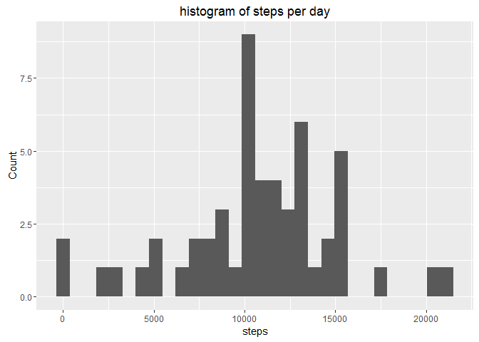
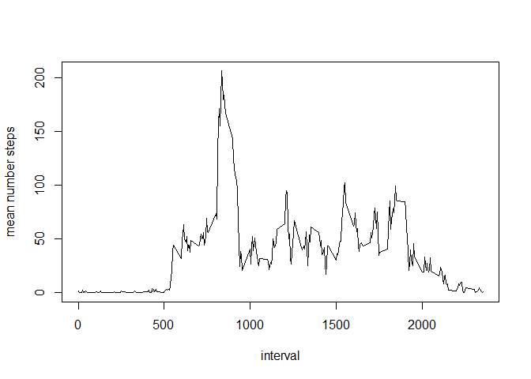
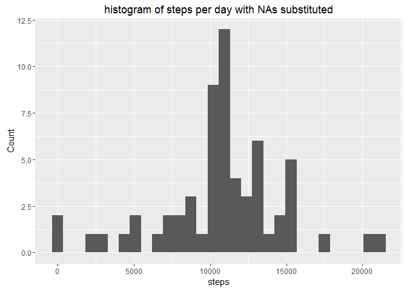

R Markdown
----------

solution for week 2 assignment reproducible research based on: Dataset:
Activity monitoring data \[52K\] The variables included in this dataset
are:

steps: Number of steps taking in a 5-minute interval (missing values are
coded as NA) date: The date on which the measurement was taken in
YYYY-MM-DD format interval: Identifier for the 5-minute interval in
which measurement was taken The dataset is stored in a
comma-separated-value (CSV) file and there are a total o

getting started

    library(ggplot2)

Read and Format the Data

    activity=read.csv(file="activity.csv")
    activity$date = as.Date(activity$date, format= "%Y-%m-%d")

1.  Calculate the total number of steps taken per day - aggregate first
    NA ignore

<!-- -->

    Agg = aggregate(activity$steps, by=list(Category=activity$date), FUN=sum)
    qplot(Agg$x, geom="histogram" )+ labs(title="histogram of steps per day",x="steps", y = "Count")

    ## `stat_bin()` using `bins = 30`. Pick better value with `binwidth`.

    ## Warning: Removed 8 rows containing non-finite values (stat_bin).

calculate median and mean

    Agg_mead = aggregate(activity$steps, by=list(Category=activity$date), FUN=median, na.rm=TRUE)
    Agg_mean = aggregate(activity$steps, by=list(Category=activity$date), FUN=mean, na.rm=TRUE)

    print(Agg_mead)

    ##      Category  x
    ## 1  2012-10-01 NA
    ## 2  2012-10-02  0
    ## 3  2012-10-03  0
    ## 4  2012-10-04  0
    ## 5  2012-10-05  0
    ## 6  2012-10-06  0
    ## 7  2012-10-07  0
    ## 8  2012-10-08 NA
    ## 9  2012-10-09  0
    ## 10 2012-10-10  0
    ## 11 2012-10-11  0
    ## 12 2012-10-12  0
    ## 13 2012-10-13  0
    ## 14 2012-10-14  0
    ## 15 2012-10-15  0
    ## 16 2012-10-16  0
    ## 17 2012-10-17  0
    ## 18 2012-10-18  0
    ## 19 2012-10-19  0
    ## 20 2012-10-20  0
    ## 21 2012-10-21  0
    ## 22 2012-10-22  0
    ## 23 2012-10-23  0
    ## 24 2012-10-24  0
    ## 25 2012-10-25  0
    ## 26 2012-10-26  0
    ## 27 2012-10-27  0
    ## 28 2012-10-28  0
    ## 29 2012-10-29  0
    ## 30 2012-10-30  0
    ## 31 2012-10-31  0
    ## 32 2012-11-01 NA
    ## 33 2012-11-02  0
    ## 34 2012-11-03  0
    ## 35 2012-11-04 NA
    ## 36 2012-11-05  0
    ## 37 2012-11-06  0
    ## 38 2012-11-07  0
    ## 39 2012-11-08  0
    ## 40 2012-11-09 NA
    ## 41 2012-11-10 NA
    ## 42 2012-11-11  0
    ## 43 2012-11-12  0
    ## 44 2012-11-13  0
    ## 45 2012-11-14 NA
    ## 46 2012-11-15  0
    ## 47 2012-11-16  0
    ## 48 2012-11-17  0
    ## 49 2012-11-18  0
    ## 50 2012-11-19  0
    ## 51 2012-11-20  0
    ## 52 2012-11-21  0
    ## 53 2012-11-22  0
    ## 54 2012-11-23  0
    ## 55 2012-11-24  0
    ## 56 2012-11-25  0
    ## 57 2012-11-26  0
    ## 58 2012-11-27  0
    ## 59 2012-11-28  0
    ## 60 2012-11-29  0
    ## 61 2012-11-30 NA

    print(Agg_mean)

    ##      Category          x
    ## 1  2012-10-01        NaN
    ## 2  2012-10-02  0.4375000
    ## 3  2012-10-03 39.4166667
    ## 4  2012-10-04 42.0694444
    ## 5  2012-10-05 46.1597222
    ## 6  2012-10-06 53.5416667
    ## 7  2012-10-07 38.2465278
    ## 8  2012-10-08        NaN
    ## 9  2012-10-09 44.4826389
    ## 10 2012-10-10 34.3750000
    ## 11 2012-10-11 35.7777778
    ## 12 2012-10-12 60.3541667
    ## 13 2012-10-13 43.1458333
    ## 14 2012-10-14 52.4236111
    ## 15 2012-10-15 35.2048611
    ## 16 2012-10-16 52.3750000
    ## 17 2012-10-17 46.7083333
    ## 18 2012-10-18 34.9166667
    ## 19 2012-10-19 41.0729167
    ## 20 2012-10-20 36.0937500
    ## 21 2012-10-21 30.6284722
    ## 22 2012-10-22 46.7361111
    ## 23 2012-10-23 30.9652778
    ## 24 2012-10-24 29.0104167
    ## 25 2012-10-25  8.6527778
    ## 26 2012-10-26 23.5347222
    ## 27 2012-10-27 35.1354167
    ## 28 2012-10-28 39.7847222
    ## 29 2012-10-29 17.4236111
    ## 30 2012-10-30 34.0937500
    ## 31 2012-10-31 53.5208333
    ## 32 2012-11-01        NaN
    ## 33 2012-11-02 36.8055556
    ## 34 2012-11-03 36.7048611
    ## 35 2012-11-04        NaN
    ## 36 2012-11-05 36.2465278
    ## 37 2012-11-06 28.9375000
    ## 38 2012-11-07 44.7326389
    ## 39 2012-11-08 11.1770833
    ## 40 2012-11-09        NaN
    ## 41 2012-11-10        NaN
    ## 42 2012-11-11 43.7777778
    ## 43 2012-11-12 37.3784722
    ## 44 2012-11-13 25.4722222
    ## 45 2012-11-14        NaN
    ## 46 2012-11-15  0.1423611
    ## 47 2012-11-16 18.8923611
    ## 48 2012-11-17 49.7881944
    ## 49 2012-11-18 52.4652778
    ## 50 2012-11-19 30.6979167
    ## 51 2012-11-20 15.5277778
    ## 52 2012-11-21 44.3993056
    ## 53 2012-11-22 70.9270833
    ## 54 2012-11-23 73.5902778
    ## 55 2012-11-24 50.2708333
    ## 56 2012-11-25 41.0902778
    ## 57 2012-11-26 38.7569444
    ## 58 2012-11-27 47.3819444
    ## 59 2012-11-28 35.3576389
    ## 60 2012-11-29 24.4687500
    ## 61 2012-11-30        NaN

What is the average daily activity pattern?

Make a time series plot (i.e. type = "l") of the 5-minute interval
(x-axis) and the average number of steps taken, averaged across all days
(y-axis) Which 5-minute interval, on average across all the days in the
dataset, contains the maximum number of steps? as average is not
defined, I go with the mean

    Agg_inter = aggregate(activity$steps, by=list(Category=activity$interval), FUN=mean, na.rm=TRUE)

    # and plot

    plot(Agg_inter$x ~ Agg_inter$Category, type="l", xlab="interval", ylab="mean number steps")

get the interval with hightest mean number of steps

    print(subset(Agg_inter, Agg_inter$x==max(Agg_inter$x) ))

    ##     Category        x
    ## 104      835 206.1698

calculate and report the total number of missing values in the dataset
(i.e. the total number of rows with NAs)

Devise a strategy for filling in all of the missing values in the
dataset. The strategy does not need to be sophisticated. For example,
you could use the mean/median for that day, or the mean for that
5-minute interval, etc.

Create a new dataset that is equal to the original dataset but with the
missing data filled in. Make a histogram of the total number of steps
taken each day and Calculate and report the mean and median total number
of steps taken per day. Do these values differ from the estimates from
the first part of the assignment? What is the impact of imputing missing
data on the estimates of the total daily number of steps?

total number of missing values 7th value of the standard summary
function gives us the NAs

    summary(activity$steps)[7]

    ## NA's 
    ## 2304

as the interval shows a much clearer influence on the mean numbber of
steps compared to the day, I will use the mean per interval to
substitute missing

    activity_sub1 = merge(activity, Agg_inter, by.x="interval", by.y="Category")

    activity_sub1$steps_sub = as.integer(ifelse(is.na(activity_sub1$steps) , activity_sub1$x ,activity_sub1$steps))

    # and recode to make it nice and tidy
    activity_sub= data.frame( activity_sub1$steps_sub, activity_sub1$date, activity_sub1$interval)
     colnames(activity_sub)=colnames(activity)
     Agg_sub = aggregate(activity_sub$steps, by=list(Category=activity_sub$date), FUN=sum)

     # plot it - gives some warning because of NA but not important

    qplot(Agg_sub$x, geom="histogram" )+ labs(title="histogram of steps per day with NAs substituted",x="steps", y = "Count")

    ## `stat_bin()` using `bins = 30`. Pick better value with `binwidth`.

    Agg_sub_mead = aggregate(activity_sub$steps, by=list(Category=activity_sub$date), FUN=median, na.rm=TRUE)
    Agg_sub_mean = aggregate(activity_sub$steps, by=list(Category=activity_sub$date), FUN=mean, na.rm=TRUE)

    print(Agg_sub_mead)

    ##      Category    x
    ## 1  2012-10-01 33.5
    ## 2  2012-10-02  0.0
    ## 3  2012-10-03  0.0
    ## 4  2012-10-04  0.0
    ## 5  2012-10-05  0.0
    ## 6  2012-10-06  0.0
    ## 7  2012-10-07  0.0
    ## 8  2012-10-08 33.5
    ## 9  2012-10-09  0.0
    ## 10 2012-10-10  0.0
    ## 11 2012-10-11  0.0
    ## 12 2012-10-12  0.0
    ## 13 2012-10-13  0.0
    ## 14 2012-10-14  0.0
    ## 15 2012-10-15  0.0
    ## 16 2012-10-16  0.0
    ## 17 2012-10-17  0.0
    ## 18 2012-10-18  0.0
    ## 19 2012-10-19  0.0
    ## 20 2012-10-20  0.0
    ## 21 2012-10-21  0.0
    ## 22 2012-10-22  0.0
    ## 23 2012-10-23  0.0
    ## 24 2012-10-24  0.0
    ## 25 2012-10-25  0.0
    ## 26 2012-10-26  0.0
    ## 27 2012-10-27  0.0
    ## 28 2012-10-28  0.0
    ## 29 2012-10-29  0.0
    ## 30 2012-10-30  0.0
    ## 31 2012-10-31  0.0
    ## 32 2012-11-01 33.5
    ## 33 2012-11-02  0.0
    ## 34 2012-11-03  0.0
    ## 35 2012-11-04 33.5
    ## 36 2012-11-05  0.0
    ## 37 2012-11-06  0.0
    ## 38 2012-11-07  0.0
    ## 39 2012-11-08  0.0
    ## 40 2012-11-09 33.5
    ## 41 2012-11-10 33.5
    ## 42 2012-11-11  0.0
    ## 43 2012-11-12  0.0
    ## 44 2012-11-13  0.0
    ## 45 2012-11-14 33.5
    ## 46 2012-11-15  0.0
    ## 47 2012-11-16  0.0
    ## 48 2012-11-17  0.0
    ## 49 2012-11-18  0.0
    ## 50 2012-11-19  0.0
    ## 51 2012-11-20  0.0
    ## 52 2012-11-21  0.0
    ## 53 2012-11-22  0.0
    ## 54 2012-11-23  0.0
    ## 55 2012-11-24  0.0
    ## 56 2012-11-25  0.0
    ## 57 2012-11-26  0.0
    ## 58 2012-11-27  0.0
    ## 59 2012-11-28  0.0
    ## 60 2012-11-29  0.0
    ## 61 2012-11-30 33.5

    print(Agg_sub_mean)

    ##      Category          x
    ## 1  2012-10-01 36.9479167
    ## 2  2012-10-02  0.4375000
    ## 3  2012-10-03 39.4166667
    ## 4  2012-10-04 42.0694444
    ## 5  2012-10-05 46.1597222
    ## 6  2012-10-06 53.5416667
    ## 7  2012-10-07 38.2465278
    ## 8  2012-10-08 36.9479167
    ## 9  2012-10-09 44.4826389
    ## 10 2012-10-10 34.3750000
    ## 11 2012-10-11 35.7777778
    ## 12 2012-10-12 60.3541667
    ## 13 2012-10-13 43.1458333
    ## 14 2012-10-14 52.4236111
    ## 15 2012-10-15 35.2048611
    ## 16 2012-10-16 52.3750000
    ## 17 2012-10-17 46.7083333
    ## 18 2012-10-18 34.9166667
    ## 19 2012-10-19 41.0729167
    ## 20 2012-10-20 36.0937500
    ## 21 2012-10-21 30.6284722
    ## 22 2012-10-22 46.7361111
    ## 23 2012-10-23 30.9652778
    ## 24 2012-10-24 29.0104167
    ## 25 2012-10-25  8.6527778
    ## 26 2012-10-26 23.5347222
    ## 27 2012-10-27 35.1354167
    ## 28 2012-10-28 39.7847222
    ## 29 2012-10-29 17.4236111
    ## 30 2012-10-30 34.0937500
    ## 31 2012-10-31 53.5208333
    ## 32 2012-11-01 36.9479167
    ## 33 2012-11-02 36.8055556
    ## 34 2012-11-03 36.7048611
    ## 35 2012-11-04 36.9479167
    ## 36 2012-11-05 36.2465278
    ## 37 2012-11-06 28.9375000
    ## 38 2012-11-07 44.7326389
    ## 39 2012-11-08 11.1770833
    ## 40 2012-11-09 36.9479167
    ## 41 2012-11-10 36.9479167
    ## 42 2012-11-11 43.7777778
    ## 43 2012-11-12 37.3784722
    ## 44 2012-11-13 25.4722222
    ## 45 2012-11-14 36.9479167
    ## 46 2012-11-15  0.1423611
    ## 47 2012-11-16 18.8923611
    ## 48 2012-11-17 49.7881944
    ## 49 2012-11-18 52.4652778
    ## 50 2012-11-19 30.6979167
    ## 51 2012-11-20 15.5277778
    ## 52 2012-11-21 44.3993056
    ## 53 2012-11-22 70.9270833
    ## 54 2012-11-23 73.5902778
    ## 55 2012-11-24 50.2708333
    ## 56 2012-11-25 41.0902778
    ## 57 2012-11-26 38.7569444
    ## 58 2012-11-27 47.3819444
    ## 59 2012-11-28 35.3576389
    ## 60 2012-11-29 24.4687500
    ## 61 2012-11-30 36.9479167

substitution increases frequencies in the hist, so not neutral here for all analysis
====================================================================================
